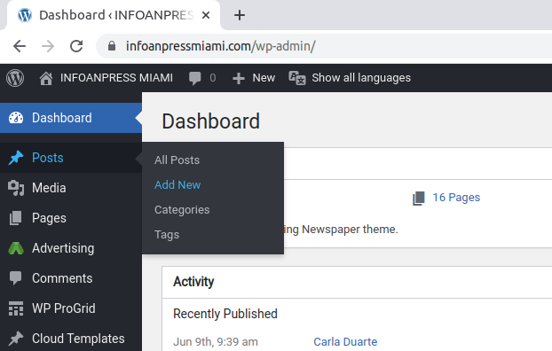
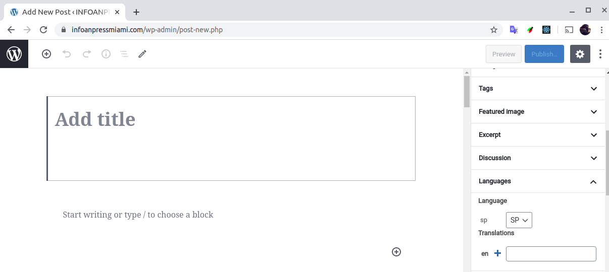
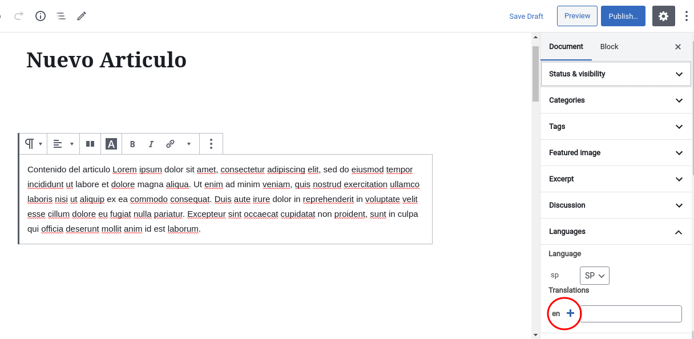
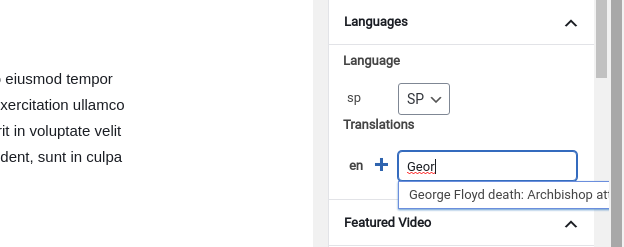

# Agregar contenido en español e inglés

El sitio esta desarrollado para permitir páginas y artículos de distintos tipo tanto en español como en inglés. Por defecto se utliza el idioma español.

Para poder agregar contenido es necesario estar logueado al sitio con perfil Editor o Administrador.

Para agregar un nuevo artículo, hacemos click en "Add New" del menú lateral "Posts"

El site nos muestra un nuevo Post vacío cuyo lenguaje por defecto es el español.

El artículo se completa normalmente y debemos guardarlo al menos una vez para poder generar su contraparte en inglés. Agregaremos un nuevo artículo que vincularemos a traves de la solapa "Language" del menu lateral:

El sitio nos muestra un nuevo artículo vacio cuyo lenguaje ya esta seleccionado para "EN" (inglés). Desde aqui el proceso es el mismo al paso anterior, completamos el artículo en idioma inglés y luego lo guardamos. 

Una vez guardado y al volver al artículo en español observaremos que ya se encuentra adjuntado el artículo en inglés en la solapa "Language" del menu lateral desde donde iniciamos la traducción.

Cabe aclarar que este proceso puede realizarse también partiendo de dos artículos ya existentes en los dos idiomas. Para este caso solo es necesario tipear el titulo del artículo en inglés que desamos vincular desde el artículo en español (y viceversa). El sitio nos ira sugiriendo los articulos existentes cuyo titulo corresponda con el que estamos tipeando.

