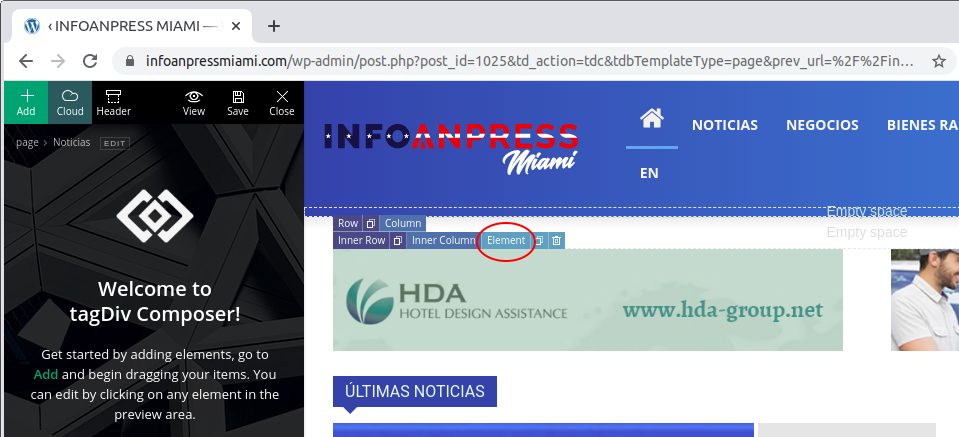

# Modificar Anuncios

El sitio infoanpressmiami.com cuenta con espacios definidos para los anuncios. Para poder modificar los anuncios es necesario estar logueado al sitio con perfil Editor o Administrador.

Los banners que se utilizan deben existir en la biblioteca de medios del sitio y deben respetar las siguientes medidas

### Dimensiones

+ horizontal tope de página: 600 X 120
+ horizontal medio de artículo: 728 X 90
+ lateral (derecha): 300 X 250

Ademas el site cuenta con 8 secciones en 2 idiomas (16 páginas) donde se pueden modificar los anuncios convenientemente para cada caso. 

## Anuncios en secciones

Para modificar los anuncios de las secciones (home, noticias, negocios,bienes raices, restaurantes, profesionales, visa) navegamos a la seccion que queremos modificar y hacemos click en "Edit with TD Composer"

El sitio muestra el editor tagDiv composer en el que seleccionaremos el anuncio a modificar, en este caso HDA. Hacemos click en "Element" del menu contextual corresponidiente al anuncio:

El editor muestra los atributos Generales del "Ad Box". Desde ahí hacemos click en la solapa "Image Ad"

Vamos a las propiedades del anuncio y procedemos a clickear en "All devices" para cambiar la imagen que se mostrará en todos los dispositivos. 

El sitio nos muestra la libreria de imagenes desde donde podemos seleccionar la imagen deseada para reemplazar el anuncio

